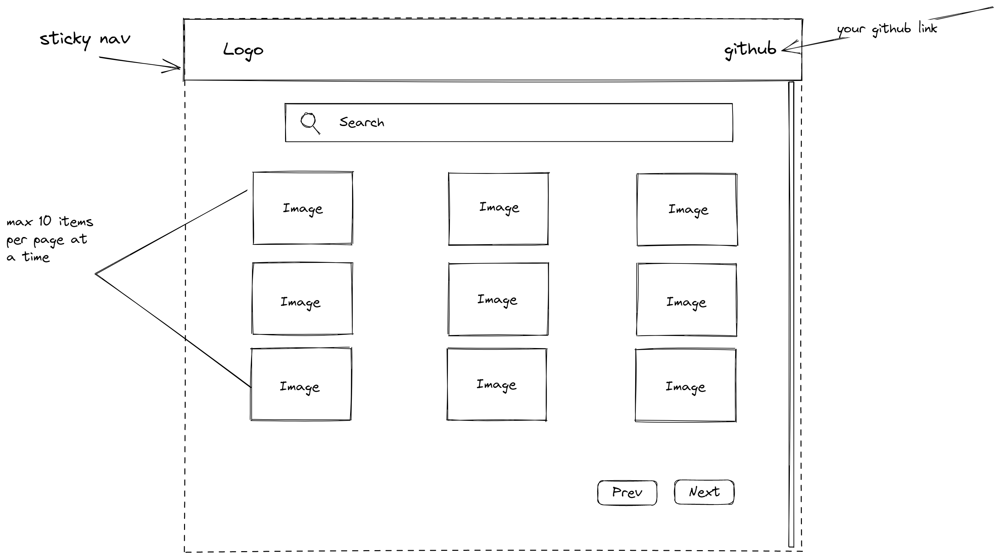
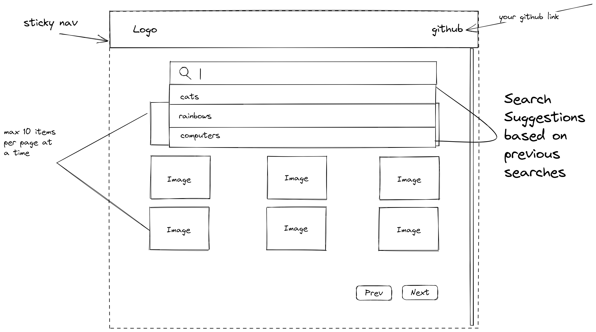

# Salt React Gallery - Day 1 - Building the MVP

## A. Scenario

A minimum viable product (MVP) is a version of a product with just enough features to satisfy early customers and provide feedback for future product development.

## B. MVP specifications

### Tech stack specifications

Following are the technical specifications:

* The project should be created with `vite`, using TypeScript
* It should be a responsive web app. Approach it with the mobile-first mindset.
* It should be tested up using Vitest as a test runner, and utilize [React Testing Library](https://testing-library.com/docs/react-testing-library/intro/)..
* Have _multiple_ React components
  * The components should be Function Components.

### MVP requirements

We want you to build an application similar to the following 'design'.

The technical requirements are fairly few, so feel free to add features if you have time. However, we require that the application:

1. Has a form which, on submit, fetches images from the [Unsplash API /search/photos endpoint](https://unsplash.com/documentation#search-photos). You'll have to set up a developer account and get an API key for making your requests.

2. When the form input is focused, a 'suggestions' list should be shown. The suggestions list should contain previous searches. We want you to do this by saving the previous searches in [window.localStorage](https://developer.mozilla.org/en-US/docs/Web/API/Window/localStorage) (which is like a database in the browser). Remember that the view should be based on the state, not the other way around.

3. When you get a response from the Unsplash API, render the 10 images as cards on the web page.

4. Every card should have a flip/rotate animation. On the backside of each card, list some text information from the Unsplash API response.

5. There should be a pagination functionality so that when clicking the `next` button, the 10 next images should be displayed. There should also be a `previous` button which fetches the previous 10 images.

6. You should have written tests.

---

GLHF!
